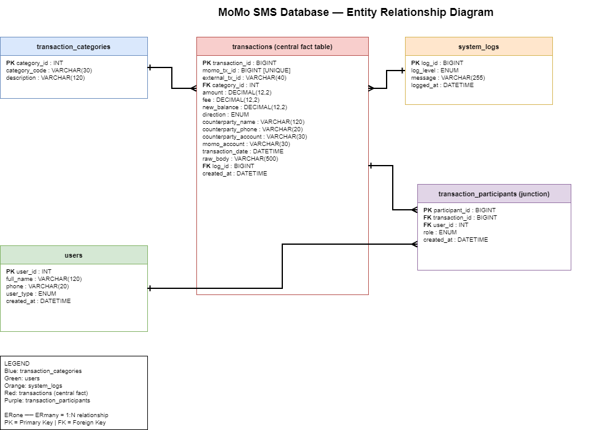

#  Team Croissant — MoMo SMS Data Pipeline & Dashboard

A team project that processes MoMo SMS XML data, stores it in a database, and visualizes it on a dashboard.

---

## Team Members

| Name | Role |
|------|------|
| Imanzi Beni | Repo Lead — project structure & environment setup |
| Rugwiro Derrick | Documentation & README |
| Ishimwe Axcel | System Architecture Diagram |
| Teta Dianah | Scrum Board & Backlog Management |
| Nshuti Lancelot | Research Lead — data analysis & DB schema design |

---

##  Project Description

### What is MoMo SMS Data?
MTN Mobile Money (MoMo) is a widely used mobile payment service. Every transaction — whether a deposit, withdrawal, transfer, airtime purchase, or bill payment — generates an SMS notification sent to the user. These SMS messages are exportable in **XML format**, and contain structured information about each transaction including the amount, date, sender/receiver, and transaction type.

### What Does This System Do?
This system builds a complete data pipeline and analytics interface on top of that raw XML data:

1. **Parse** — reads and extracts transaction records from the raw XML file
2. **Clean & Normalize** — standardizes amounts (strips currency symbols), formats dates consistently, and normalizes phone numbers
3. **Categorize** — classifies each transaction into a type (e.g. incoming money, sent payment, airtime purchase, bank deposit, withdrawal via agent, etc.)
4. **Load** — stores the cleaned, categorized records into a SQLite relational database
5. **Export** — generates a `dashboard.json` file aggregating key metrics for the frontend to consume
6. **Visualize** — presents the data through a browser-based dashboard with charts and summary tables


---

##  System Architecture

[Architecture Diagram](architecture.png)

**High-level flow:**
```
raw/momo.xml
     │
     ▼
[ETL Pipeline]
  parse_xml.py  →  clean_normalize.py  →  categorize.py  →  load_db.py
     │
     ▼
 db.sqlite3
     │
     ├──▶ export → data/processed/dashboard.json
     │
     ▼
[Frontend Dashboard]
  index.html + chart_handler.js
     │
     ▼ (optional)
[FastAPI Layer]
  /transactions  /analytics
```

---

##  Project Structure

```
.
├── README.md                         # Project overview, setup, and links
├── .env.example                      # Environment variable template
├── requirements.txt                  # Python dependencies
├── index.html                        # Dashboard entry point (static)
├── web/
│   ├── styles.css                    # Dashboard styling
│   ├── chart_handler.js              # Fetches data and renders charts/tables
│   └── assets/                       # Images and icons
├── data/
│   ├── raw/                          # Raw XML input (git-ignored)
│   │   └── momo.xml
│   ├── processed/                    # Aggregated output for the frontend
│   │   └── dashboard.json
│   ├── db.sqlite3                    # SQLite database file
│   └── logs/
│       ├── etl.log                   # Structured logs from ETL runs
│       └── dead_letter/              # XML snippets that failed to parse
├── etl/
│   ├── __init__.py
│   ├── config.py                     # File paths, thresholds, category rules
│   ├── parse_xml.py                  # XML parsing using ElementTree/lxml
│   ├── clean_normalize.py            # Amount, date, and phone normalization
│   ├── categorize.py                 # Rule-based transaction classification
│   ├── load_db.py                    # Table creation and upsert logic
│   └── run.py                        # CLI: runs the full ETL pipeline
├── api/                              # Optional bonus API layer
│   ├── __init__.py
│   ├── app.py                        # FastAPI app with /transactions, /analytics
│   ├── db.py                         # SQLite connection helpers
│   └── schemas.py                    # Pydantic response models
├── scripts/
│   ├── run_etl.sh                    # Runs the full ETL pipeline
│   ├── export_json.sh                # Rebuilds dashboard.json
│   └── serve_frontend.sh             # Starts a local HTTP server
└── tests/
    ├── test_parse_xml.py
    ├── test_clean_normalize.py
    └── test_categorize.py
```

---

## Setup & Installation

Setup instructions will be updated as we build the project.

### Prerequisites
- Python 3.9+
- pip

### Steps

```bash
# 1. Clone the repository
git clone https://github.com/imz-beni/Croissant1.git
cd Croissant1

# 2. Set up environment variables
cp .env.example .env
# Edit .env with your local values (e.g. path to SQLite DB)

# 3. Install Python dependencies
pip install -r requirements.txt

# 4. Place your MoMo XML file
cp /path/to/your/momo.xml data/raw/momo.xml

# 5. Run the ETL pipeline
bash scripts/run_etl.sh

# 6. Launch the frontend dashboard
bash scripts/serve_frontend.sh
# Then open http://localhost:8000 in your browser
```

---

##  Tech Stack

| Layer | Technology |
|-------|-----------|
| XML Parsing | Python — `xml.etree.ElementTree` / `lxml` |
| Data Cleaning | Python — `dateutil`, `re` |
| Database | SQLite via `sqlite3` |
| Backend API  | FastAPI + Pydantic |
| Frontend | HTML5, CSS3, Vanilla JavaScript |
| Data Visualization | Chart.js  |
| Project Management | GitHub Projects |

---

##  Scrum Board

https://github.com/users/Teta-Dianah/projects/1

---
## Database Design (Week 2)

The database layer uses **MySQL 8.x with InnoDB** engine. The schema is built around one central fact table (transactions) with four supporting tables, plus a junction table that resolves the many-to-many relationship between users and transactions.

### Schema Overview

| Table | Role | Purpose |
|-------|------|---------|
| transaction_categories | Lookup | 8 distinct MoMo transaction types observed in the SMS data |
| users | Core | Every person or organisation involved in a transaction |
| system_logs | Core | Audit trail for the ETL pipeline |
| transactions | Central fact | One row per MoMo SMS transaction parsed from the source XML |
| transaction_participants | Junction | Resolves the Users ↔ Transactions many-to-many relationship |

### ERD Diagram




# Start MySQL and create the database
mysql -u root -p
sql
CREATE DATABASE momo_db;
USE momo_db;
SOURCE database/database_setup.sql;

### Repository Structure (Week 2 additions)

```
├── database/
│   ├── database_setup.sql        # Full schema — run this to set up the database
│   ├── categories.sql            # Transaction_Categories table
│   ├── users.sql                 # Users table
│   ├── system_logs.sql           # System_Logs table
│   ├── transactions.sql          # Transactions table (central fact)
│   ├── junction_table.sql        # Transaction_Participants junction table
│   ├── indexes.sql               # Performance indexes across the schema
│   └── validation_rules.sql      # CHECK constraints for data integrity
├── docs/
│   ├── ERD_Diagram.drawio        # Editable ERD source file
│   ├── ERD_Diagram.png           # Exported ERD image
│   ├── design_rationale.md       # Schema design justification
│   ├── data_dictionary_*.md      # Per-table column descriptions
│   └── demo_queries_*.sql        # Per-member demonstration queries
└── examples/
    ├── categories_schema.json    # JSON schema for Transaction_Categories
    ├── users_schema.json         # JSON schema for Users
    ├── system_logs_schema.json   # JSON schema for System_Logs
    ├── transactions_schema.json  # JSON schema for Transactions
    ├── junction_schema.json      # JSON schema for Transaction_Participants
    └── complex_transaction.json  # Full nested transaction API response

```
### Design Decisions

Money values use DECIMAL(12,2) — never floating point, to avoid rounding errors on totals
Transaction IDs use BIGINT — real MoMo provider IDs (e.g. 76662021700) exceed the range of INT
Phone numbers are stored as VARCHAR(20) — values can be masked (*********013) or carry a country prefix (250791666666)
Small fixed value sets use ENUM — invalid entries are rejected at the database level
Every table has a single-column surrogate primary key for stable row identification
Foreign keys use explicit ON DELETE rules: RESTRICT for lookups, CASCADE for the junction, SET NULL for logs

### Week 2 Contributions

| Member | Contribution |
|--------|--------------|
| Nshuti Lancelot | Schema design, Transactions table, junction table, design rationale |
| Imanzi Beni | Users table, indexes, database_setup.sql integration |
| Ishimwe Axcel | Transaction_Categories table, ERD diagram, demo queries |
| Teta Dianah | System_Logs table, CHECK constraints, AI usage log |
| Rugwiro Derrick | Complex nested JSON, integration tests, final PDF assembly |

---
