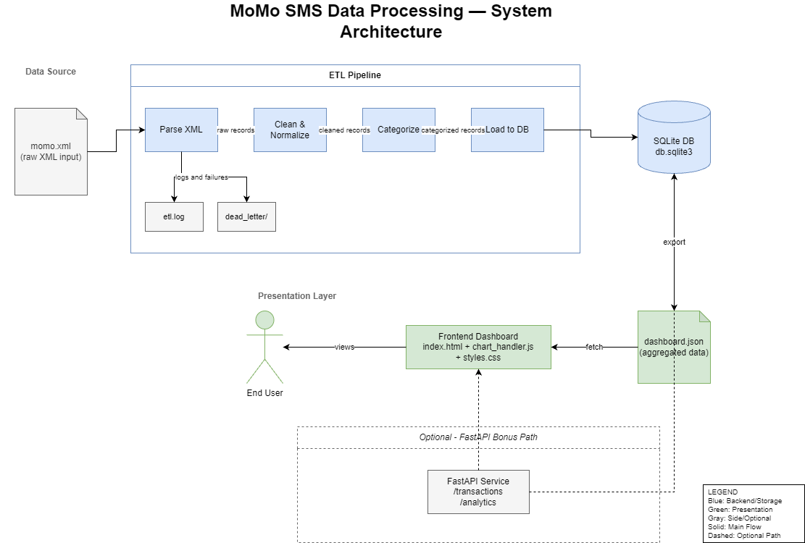
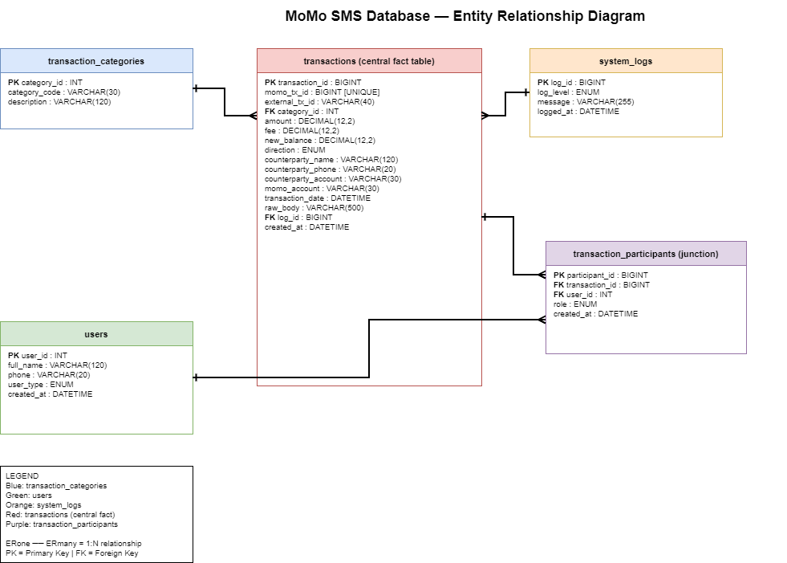

# Team Croissant — MoMo SMS Data Pipeline & Dashboard

An end-to-end pipeline that parses MTN Mobile Money (MoMo) SMS XML exports, normalizes and categorizes the transactions, loads them into MySQL, and surfaces the results through a browser dashboard and a small REST API.

---

## Team

| Name | Role |
|------|------|
| Imanzi Beni | Repo Lead — project structure & environment setup |
| Rugwiro Derrick | Documentation, REST API endpoints |
| Ishimwe Axcel | System architecture diagram |
| Teta Dianah | Scrum board & backlog management |
| Nshuti Lancelot | Research Lead — data analysis & DB schema design |

**Scrum board:** https://github.com/users/Teta-Dianah/projects/1

---

## What the system does

MoMo SMS messages are exportable in XML and describe every deposit, withdrawal, transfer, airtime purchase, and bill payment a user makes. This project turns that raw feed into something queryable and visual:

1. **Parse** — read transaction records from the raw XML
2. **Clean & normalize** — standardize amounts, dates, and phone numbers
3. **Categorize** — classify each transaction (incoming money, sent payment, airtime, deposit, agent withdrawal, …)
4. **Load** — persist into a MySQL relational schema
5. **Export** — aggregate metrics into `data/processed/dashboard.json`
6. **Visualize** — render charts and summary tables in the browser
7. **Serve** — expose CRUD endpoints over the processed transactions

---

## Architecture



```
raw/momo.xml
     │
     ▼
[ETL]  parse_xml → clean_normalize → categorize → load_db
     │
     ▼
MySQL (momo_db) ──▶ export ──▶ data/processed/dashboard.json
     │                                    │
     ▼                                    ▼
[REST API]                         [Frontend Dashboard]
/transactions  /analytics          index.html + chart_handler.js
```

---

## Repository layout

```
.
├── README.md
├── .env.example                 # Environment variable template
├── requirements.txt             # Python dependencies
├── architecture.{drawio,png}    # System architecture diagram
├── index.html                   # Dashboard entry point
│
├── web/                         # Frontend assets
│   ├── styles.css
│   ├── chart_handler.js
│   └── assets/
│
├── data/
│   ├── raw/momo.xml             # Raw XML input (git-ignored)
│   ├── processed/               # dashboard.json, transactions.json
│   └── logs/                    # ETL logs & dead-letter XML snippets
│
├── etl/                         # parse_xml, clean_normalize, categorize, load_db, run
│
├── api/
│   ├── app.py, db.py, schemas.py
│   └── endpoints/
│       ├── create.py            # POST /transactions
│       └── update.py            # PUT /transactions/{id}
│
├── database/                    # SQL schema, indexes, validation, tests
├── docs/                        # ERD, design rationale, screenshots, AI usage log
├── examples/                    # JSON schemas + sample nested payloads
├── scripts/                     # run_etl.sh, export_json.sh, serve_frontend.sh
└── tests/                       # Pytest suite for the ETL stages
```

---

## Setup

**Prerequisites:** Python 3.9+, pip, MySQL 8.0+

```bash
# 1. Clone
git clone https://github.com/imz-beni/Croissant1.git
cd Croissant1

# 2. Environment
cp .env.example .env
# edit .env with your MySQL connection settings

# 3. Dependencies
pip install -r requirements.txt

# 4. Database
mysql -u root -p < database/database_setup.sql
mysql -u root -p momo_db < database/validation_rules.sql

# 5. Drop in your XML export
cp /path/to/momo.xml data/raw/momo.xml

# 6. Run the ETL
bash scripts/run_etl.sh

# 7. Serve the dashboard
bash scripts/serve_frontend.sh   # http://localhost:8000
```

---

## Database design(Week 2)

MySQL 8.x / InnoDB. One central fact table (`transactions`) with four supporting tables, plus a junction table that resolves the many-to-many relationship between users and transactions.

| Table | Role | Purpose |
|-------|------|---------|
| `transaction_categories` | Lookup | 8 MoMo transaction types observed in the SMS data |
| `users` | Core | Every person or organisation involved in a transaction |
| `system_logs` | Core | Audit trail for the ETL pipeline |
| `transactions` | Fact | One row per MoMo SMS transaction |
| `transaction_participants` | Junction | Users ↔ Transactions many-to-many |



### Design decisions

- **Money** is `DECIMAL(12,2)` — never floating point, to avoid rounding errors on totals.
- **Transaction IDs** are `BIGINT` — real MoMo provider IDs (e.g. `76662021700`) exceed `INT` range.
- **Phone numbers** are `VARCHAR(20)` — values can be masked (`*********013`) or carry a country prefix (`250791666666`).
- **Small enumerations** use `ENUM` — invalid entries are rejected at the DB level.
- **Surrogate keys** on every table for stable row identification.
- **Foreign keys** use explicit ON DELETE rules: `RESTRICT` for lookups, `CASCADE` for the junction, `SET NULL` for logs.

### SQL files

| File | Contents |
|------|----------|
| `database/database_setup.sql` | Full schema — run first |
| `database/validation_rules.sql` | Additional `CHECK` constraints |
| `database/indexes.sql` | Performance indexes |
| `database/integration_tests.sql` | End-to-end insert/select/update/delete |
| `database/mapping_queries.sql` | `JSON_OBJECT` queries assembling nested payloads |

---

## REST API
 
The API is built on Python's standard-library `http.server` and protected by **HTTP Basic Authentication**. It reads and writes `data/processed/transactions.json`.
 
**Authentication** — every request requires Basic Auth (`username: admin`, `password: momo2024`). Missing or wrong credentials return `401 Unauthorized`.
 
| Method | Path | Handler | Description |
|--------|------|---------|-------------|
| GET | `/transactions` | `router.py` | List all transactions with a count |
| GET | `/transactions/{id}` | `endpoints/retrieve.py` | Fetch one transaction by ID |
| POST | `/transactions` | `endpoints/create.py` | Create a transaction (`201`; `400` on missing field) |
| PUT | `/transactions/{id}` | `endpoints/update.py` | Update a transaction (`200` / `404`) |
| DELETE | `/transactions/{id}` | `endpoints/delete.py` | Delete a transaction (`404` if not found) |
 
POST requires `transaction_type`, `amount`, and `timestamp`; `currency` defaults to `RWF`. Full field reference and examples are in [`docs/api_docs.md`](docs/api_docs.md).
 
### Examples
 
```bash
# List all transactions
curl -u admin:momo2024 http://localhost:8000/transactions
 
# Create a transaction
curl -u admin:momo2024 -X POST http://localhost:8000/transactions \
>>>>>>> e835ad6 (Updated README)
  -H "Content-Type: application/json" \
  -d '{"transaction_type":"INCOMING_MONEY","amount":5000,"timestamp":"2024-05-12T09:30:00"}'
 
# Update a transaction
curl -u admin:momo2024 -X PUT http://localhost:8000/transactions/1 \
  -H "Content-Type: application/json" \
  -d '{"amount":7500,"fee":50}'
<<<<<<< HEAD
=======
 
# Delete a transaction
curl -u admin:momo2024 -X DELETE http://localhost:8000/transactions/1
```
 
---
 
## Data structures & algorithms
 
The `dsa/` module studies how transaction lookup scales with dataset size. It compares **linear search** (`O(n)` — scan every record) against a **dictionary / hash-table lookup** (`O(1)` average, after a one-time `O(n)` build), with binary search included for the sorted-array case. `dsa/performance_test.py` times each method over many lookups and reports the speedup.
 
```bash
python dsa/performance_test.py
```
 
---
 
## Setup
 
**Prerequisites:** Python 3.9+, pip, MySQL 8.0+
 
```bash
# 1. Clone
git clone https://github.com/imz-beni/Croissant1.git
cd Croissant1
 
# 2. Environment
cp .env.example .env          # edit with your MySQL connection settings
 
# 3. Dependencies
pip install -r requirements.txt
 
# 4. Database
mysql -u root -p < database/database_setup.sql
mysql -u root -p momo_db < database/validation_rules.sql
 
# 5. Drop in your XML export
cp /path/to/momo.xml data/raw/momo.xml
 
# 6. Run the ETL pipeline
bash scripts/run_etl.sh
 
# 7. Start the API
python -m api.server          # http://localhost:8000  (Basic Auth: admin / momo2024)
 
# 8. Serve the dashboard
bash scripts/serve_frontend.sh
```
 
---
 
## Tech stack
 
| Layer | Technology |
|-------|-----------|
| XML parsing | Python — `xml.etree.ElementTree` |
| Data cleaning | Python — `dateutil`, `re` |
| Database | MySQL 8.x (InnoDB) |
| Backend API | Python standard library `http.server` + Basic Auth |
| Frontend | HTML5, CSS3, Vanilla JS |
| Visualization | Chart.js |
| Testing | Pytest |
| Project management | GitHub Projects (Scrum) |
 
---
 
## Additional documentation
 
| Path | Purpose |
|------|---------|
| [docs/design_rationale.md](docs/design_rationale.md) | Schema design justification (Nshuti Lancelot) |
| [docs/sql_to_json_mapping.md](docs/sql_to_json_mapping.md) | Column → JSON key mapping |
| [docs/api_docs.md](docs/api_docs.md) | Full REST API reference |
| [docs/research_standards.md](docs/research_standards.md) | Team analysis & documentation conventions |
| [docs/ai_usage_log.md](docs/ai_usage_log.md) | Log of AI assistance |
| [docs/tasks.md](docs/tasks.md) | Week-by-week task breakdown & assignments |
| [docs/demo_queries_*.sql](docs/) | Per-member demo / CRUD queries |
| [docs/screenshots/](docs/screenshots) | CRUD, constraint, and demo-query screenshots |
| [examples/json_schemas.json](examples/json_schemas.json) | Consolidated JSON schema bundle |
| [examples/complex_transaction.json](examples/complex_transaction.json) | Full nested transaction API response |
 
---
